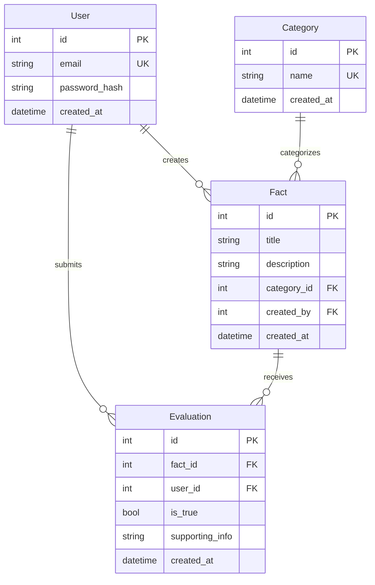

# Design Document

## Overview

The Fact Checking Application is a Flask-based web application that enables users to register, authenticate, and evaluate factual claims. The system follows Flask's application factory pattern and uses Flask-SQLAlchemy for database operations, Flask-Login for session management, and Pydantic for data validation. The architecture emphasizes separation of concerns with distinct layers for data models, business logic, routes, and presentation.

## Architecture

The application follows a layered architecture pattern:

```
┌─────────────────────────────────────┐
│     Presentation Layer              │
│  (HTML Templates + CSS)             │
└─────────────────────────────────────┘
              ↓
┌─────────────────────────────────────┐
│     Route Layer                     │
│  (Flask Blueprints)                 │
└─────────────────────────────────────┘
              ↓
┌─────────────────────────────────────┐
│     Business Logic Layer            │
│  (Service Functions)                │
└─────────────────────────────────────┘
              ↓
┌─────────────────────────────────────┐
│     Data Access Layer               │
│  (SQLAlchemy Models)                │
└─────────────────────────────────────┘
              ↓
┌─────────────────────────────────────┐
│     Database (SQLite/PostgreSQL)    │
└─────────────────────────────────────┘
```

### Technology Stack

- **Web Framework**: Flask 3.x
- **Database ORM**: Flask-SQLAlchemy
- **Authentication**: Flask-Login
- **Password Hashing**: Werkzeug security utilities
- **Data Validation**: Pydantic
- **Template Engine**: Jinja2 (Flask default)
- **Development Server**: Flask development server (127.0.0.1:5001)
- **Production Server**: Gunicorn
- **Database**: SQLite (development), PostgreSQL (production)

## Components and Interfaces

### 1. Application Factory (`src/__init__.py`)

Creates and configures the Flask application instance following the application factory pattern.

**Responsibilities:**
- Initialize Flask app with configuration
- Register extensions (SQLAlchemy, Login Manager)
- Register blueprints
- Configure error handlers

**Interface:**
```python
def create_app(config_name: str = 'development') -> Flask:
    """Create and configure Flask application"""
```

### 2. Models (`src/models/`)

SQLAlchemy models representing database entities.

**User Model:**
```python
class User(UserMixin, db.Model):
    id: int
    email: str (unique, indexed)
    password_hash: str
    created_at: datetime
    
    def set_password(password: str) -> None
    def check_password(password: str) -> bool
```

**Category Model:**
```python
class Category(db.Model):
    id: int
    name: str (unique)
    created_at: datetime
```

**Fact Model:**
```python
class Fact(db.Model):
    id: int
    title: str
    description: str
    category_id: int (foreign key)
    created_by: int (foreign key to User)
    created_at: datetime
```

**Evaluation Model:**
```python
class Evaluation(db.Model):
    id: int
    fact_id: int (foreign key)
    user_id: int (foreign key)
    is_true: bool
    supporting_info: str (optional)
    created_at: datetime
```

### 3. Routes (`src/routes/`)

Flask blueprints handling HTTP requests and responses.

**Auth Blueprint (`auth.py`):**
- `GET /register` - Display registration form
- `POST /register` - Process registration
- `GET /login` - Display login form
- `POST /login` - Process login
- `GET /logout` - Log out user

**Main Blueprint (`main.py`):**
- `GET /` - Dashboard (requires login)
- `GET /fact/<id>` - View fact details (requires login)
- `POST /fact/<id>/evaluate` - Submit evaluation (requires login)
- `GET /fact/new` - Display fact creation form (requires login)
- `POST /fact/new` - Create new fact (requires login)
- `GET /category/new` - Display category creation form (requires login)
- `POST /category/new` - Create new category (requires login)

### 4. Extensions (`src/extensions.py`)

Centralized initialization of Flask extensions.

```python
db = SQLAlchemy()
login_manager = LoginManager()
```

### 5. Templates (`src/templates/`)

Jinja2 templates with semantic HTML and CSS classes.

**Template Structure:**
- `base.html` - Base template with common layout
- `auth/register.html` - Registration form
- `auth/login.html` - Login form
- `dashboard.html` - Main dashboard
- `fact_detail.html` - Fact viewing and evaluation
- `fact_form.html` - Fact creation form
- `category_form.html` - Category creation form

### 6. Static Assets (`src/static/`)

CSS stylesheets and other static files.

- `css/main.css` - Base stylesheet with semantic class names

## Data Models

### Entity Relationship Diagram



### Database Constraints

- User.email: UNIQUE, NOT NULL, valid email format
- Category.name: UNIQUE, NOT NULL
- Fact.title: NOT NULL
- Fact.category_id: FOREIGN KEY references Category.id
- Fact.created_by: FOREIGN KEY references User.id
- Evaluation.fact_id: FOREIGN KEY references Fact.id
- Evaluation.user_id: FOREIGN KEY references User.id
- Evaluation.is_true: NOT NULL

## Correctness Properties

*A property is a characteristic or behavior that should hold true across all valid executions of a system—essentially, a formal statement about what the system should do. Properties serve as the bridge between human-readable specifications and machine-verifiable correctness guarantees.*


### User Registration and Authentication Properties

**Property 1: Valid registration creates user account**
*For any* valid email address and password combination, submitting a registration form should result in a new User account being created in the database.
**Validates: Requirements 1.1**

**Property 2: Invalid email formats are rejected**
*For any* string that does not match valid email format patterns, attempting to register should be rejected and return an error message.
**Validates: Requirements 1.2**

**Property 3: Password hashing security**
*For any* user account created, the stored password in the database should be a hash and not the plaintext password.
**Validates: Requirements 1.4**

**Property 4: Valid credentials authenticate successfully**
*For any* registered user with valid credentials, submitting a login form should authenticate the user and create a session.
**Validates: Requirements 2.1, 2.3**

**Property 5: Invalid credentials are rejected**
*For any* login attempt with credentials that don't match a registered user, the system should reject authentication and return an error message.
**Validates: Requirements 2.2**

**Property 6: Logout terminates session**
*For any* authenticated user, performing a logout action should terminate the session and prevent access to protected pages.
**Validates: Requirements 2.4**

### Dashboard and Navigation Properties

**Property 7: Dashboard displays all facts**
*For any* set of facts in the database, accessing the dashboard should display all facts with their titles and categories.
**Validates: Requirements 3.2**

### Fact Management Properties

**Property 8: Fact creation with valid data**
*For any* valid fact data (title, description, category), submitting a fact creation form should create a new Fact associated with the specified category and store the creator's user ID and timestamp.
**Validates: Requirements 4.1, 4.4**

**Property 9: Empty title rejection**
*For any* fact creation attempt where the title is empty or contains only whitespace, the system should reject the creation and return an error message.
**Validates: Requirements 4.2**

**Property 10: Created facts appear on dashboard**
*For any* newly created fact, it should appear in the dashboard fact list immediately after creation.
**Validates: Requirements 4.3**

**Property 11: Fact details display completely**
*For any* fact in the system, viewing its detail page should display the title, description, and category information.
**Validates: Requirements 6.1**

### Category Management Properties

**Property 12: Category creation with valid name**
*For any* valid category name, submitting a category creation form should create a new Category in the database.
**Validates: Requirements 5.1**

**Property 13: Empty category name rejection**
*For any* category creation attempt where the name is empty or contains only whitespace, the system should reject the creation and return an error message.
**Validates: Requirements 5.3**

**Property 14: Categories available for fact creation**
*For any* category created in the system, it should appear as an option in the fact creation form.
**Validates: Requirements 5.4**

### Evaluation Properties

**Property 15: Evaluation recording with metadata**
*For any* fact evaluation (marking as true or false), the system should store the evaluation with the user ID, timestamp, and the boolean value indicating the user's judgment.
**Validates: Requirements 6.2, 6.3, 6.4**

**Property 16: Supporting info storage**
*For any* evaluation submitted, the system should store the supporting info if provided, or store the evaluation without supporting info if not provided.
**Validates: Requirements 7.2, 7.3**

**Property 17: Evaluation display with counts**
*For any* fact with evaluations, viewing the fact detail page should display all evaluations with counts of how many users marked it as true vs false.
**Validates: Requirements 6.5**

**Property 18: Supporting info display**
*For any* fact with evaluations that include supporting info, viewing the fact detail page should display the supporting info alongside each evaluation.
**Validates: Requirements 7.4**

## Error Handling

### Authentication Errors

- **Invalid Credentials**: Return 401 Unauthorized with user-friendly error message
- **Duplicate Email**: Return 400 Bad Request with message indicating email already exists
- **Invalid Email Format**: Return 400 Bad Request with message indicating invalid email format
- **Session Expired**: Redirect to login page with message indicating session expiration

### Validation Errors

- **Missing Required Fields**: Return 400 Bad Request with specific field error messages
- **Invalid Data Types**: Return 400 Bad Request with type validation error messages
- **Foreign Key Violations**: Return 400 Bad Request with message indicating invalid reference

### Database Errors

- **Connection Failures**: Return 500 Internal Server Error and log error details
- **Constraint Violations**: Return 400 Bad Request with user-friendly constraint error message
- **Transaction Failures**: Rollback transaction and return 500 Internal Server Error

### Authorization Errors

- **Unauthenticated Access**: Redirect to login page with message indicating authentication required
- **Insufficient Permissions**: Return 403 Forbidden (if role-based access is added in future)

### Error Response Format

All API errors should return JSON responses with the following structure:

```json
{
  "error": "Error type",
  "message": "User-friendly error message",
  "field": "field_name (for validation errors)"
}
```

## Testing Strategy

### Unit Testing

The application will use pytest as the testing framework with the following test categories:

**Model Tests:**
- Test User password hashing and verification
- Test model relationships (Fact-Category, Fact-User, Evaluation-Fact)
- Test model validation constraints
- Test timestamp generation on model creation

**Route Tests:**
- Test registration endpoint with valid and invalid data
- Test login endpoint with valid and invalid credentials
- Test logout functionality
- Test dashboard rendering
- Test fact creation, viewing, and evaluation endpoints
- Test category creation endpoints
- Test authentication requirements for protected routes

**Form Validation Tests:**
- Test email format validation
- Test required field validation
- Test duplicate prevention (email, category name)
- Test whitespace handling in text fields

### Property-Based Testing

The application will use Hypothesis as the property-based testing library. Each property-based test will run a minimum of 100 iterations to ensure comprehensive coverage across the input space.

**Testing Configuration:**
- Library: Hypothesis (Python)
- Minimum iterations per property: 100
- Test tagging format: `# Feature: fact-checking-app, Property {number}: {property_text}`

**Property Test Implementation:**

Each correctness property listed above will be implemented as a property-based test. The tests will:

1. Generate random valid inputs using Hypothesis strategies
2. Execute the system operation
3. Verify the expected property holds
4. Handle edge cases through generator configuration

**Generator Strategies:**

- **Email addresses**: Use Hypothesis email strategy with valid formats
- **Passwords**: Generate strings with minimum length and character requirements
- **Fact titles/descriptions**: Generate non-empty strings with various lengths
- **Category names**: Generate unique strings
- **Boolean evaluations**: Generate True/False values
- **Supporting info**: Generate optional text strings

**Edge Cases Handled by Generators:**

- Empty strings and whitespace-only strings
- Very long strings
- Special characters in text fields
- Unicode characters
- Boundary values for numeric fields

### Integration Testing

Integration tests will verify end-to-end workflows:

- Complete user registration and login flow
- Creating a category, then creating a fact in that category
- Creating a fact, then evaluating it with and without supporting info
- Viewing dashboard after creating multiple facts and categories

### Test Database

- Use SQLite in-memory database for tests
- Create fresh database for each test
- Use fixtures to set up common test data
- Clean up database after each test

## Configuration

### Environment Variables

```
# Flask Configuration
FLASK_APP=src
FLASK_ENV=development|production
SECRET_KEY=<random-secret-key>

# Database Configuration
DATABASE_URL=sqlite:///app.db (development)
DATABASE_URL=postgresql://... (production)

# Server Configuration
HOST=127.0.0.1 (development)
PORT=5001 (development)
```

### Development Configuration

```python
class DevelopmentConfig:
    DEBUG = True
    TESTING = False
    SQLALCHEMY_DATABASE_URI = 'sqlite:///dev.db'
    SQLALCHEMY_TRACK_MODIFICATIONS = False
    SECRET_KEY = os.environ.get('SECRET_KEY') or 'dev-secret-key'
```

### Production Configuration

```python
class ProductionConfig:
    DEBUG = False
    TESTING = False
    SQLALCHEMY_DATABASE_URI = os.environ.get('DATABASE_URL')
    SQLALCHEMY_TRACK_MODIFICATIONS = False
    SECRET_KEY = os.environ.get('SECRET_KEY')
```

## Deployment

### Development Server

```bash
export FLASK_APP=src
export FLASK_ENV=development
uv run flask run --host=127.0.0.1 --port=5001
```

### Production Server (Gunicorn)

```bash
uv run gunicorn -w 4 -b 0.0.0.0:8000 "src:create_app()"
```

### Database Migrations

Use Flask-Migrate for database schema management:

```bash
uv run flask db init
uv run flask db migrate -m "Initial migration"
uv run flask db upgrade
```

## Security Considerations

1. **Password Security**: Use Werkzeug's `generate_password_hash` with strong hashing algorithm (pbkdf2:sha256)
2. **Session Security**: Use secure session cookies with httponly and secure flags in production
3. **CSRF Protection**: Implement CSRF tokens for all forms (Flask-WTF)
4. **SQL Injection Prevention**: Use SQLAlchemy ORM parameterized queries
5. **XSS Prevention**: Use Jinja2 auto-escaping for all template variables
6. **Input Validation**: Validate all user inputs using Pydantic models
7. **Authentication**: Use Flask-Login for session management with login_required decorator

## CSS Architecture

### Class Naming Convention

Use BEM (Block Element Modifier) methodology for CSS class names:

```
.block__element--modifier
```

### Base Stylesheet Structure

```css
/* Layout */
.container { }
.header { }
.main { }
.footer { }

/* Components */
.card { }
.card__title { }
.card__content { }
.button { }
.button--primary { }
.button--secondary { }
.form { }
.form__group { }
.form__label { }
.form__input { }

/* Pages */
.dashboard { }
.dashboard__header { }
.dashboard__facts { }
.fact-detail { }
.fact-detail__info { }
.fact-detail__evaluations { }
```

### Customization Points

All colors, fonts, spacing, and layout properties will be defined as CSS custom properties (variables) at the root level, allowing easy customization without modifying component styles:

```css
:root {
  --primary-color: #007bff;
  --secondary-color: #6c757d;
  --background-color: #ffffff;
  --text-color: #333333;
  --font-family: -apple-system, BlinkMacSystemFont, "Segoe UI", Roboto, sans-serif;
  --spacing-unit: 1rem;
  --border-radius: 4px;
}
```
